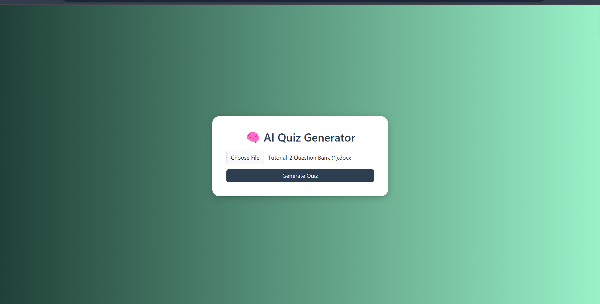
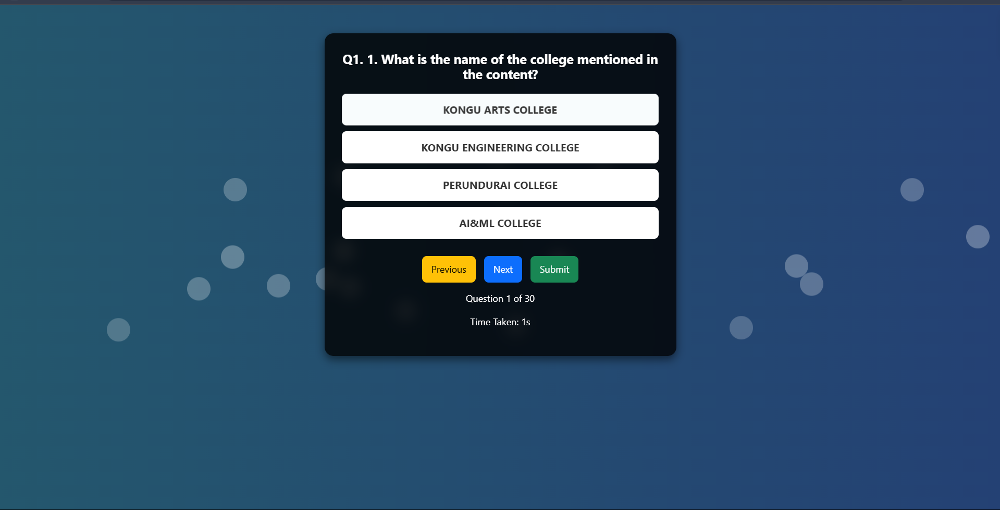
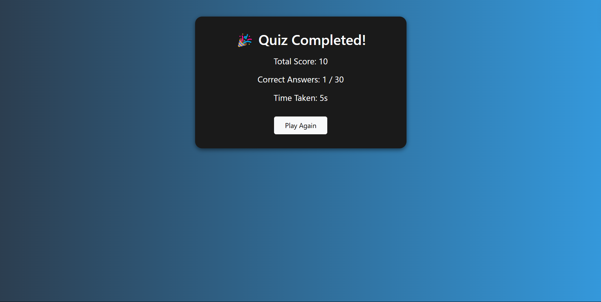

  

<h1 align="center" style="font-family: 'Arial Black', sans-serif; color: #3498db;">GenAi Quezz Games</h1>

  <strong style="font-family: 'Segoe UI', Tahoma, Geneva, Verdana, sans-serif; font-size: 1.2em;">Unleash Your Knowledge with AI-Powered Quizzes!</strong>

 

  <a href="https://genai-quezz-game-2.onrender.com" style="font-family: 'Verdana', sans-serif; color: #2ecc71; text-decoration: none;">
    <strong style="font-size: 1.1em;">View Live</strong>
  </a>
   | 
  <a href="dhamodraprasathcm.23aim@kongu.edu" style="font-family: 'Verdana', sans-serif; color: #f39c12; text-decoration: none;">
    <strong style="font-size: 1.1em;">Report Issues</strong>
  </a>

 

<h2 style="font-family: 'Georgia', serif; color: #e74c3c;">🚀 Project Overview</h2>

  <strong style="font-weight: bold;">GenAi Quezz Games</strong> is an engaging web application that leverages the power of Artificial Intelligence, specifically the <a href="https://groq.com/" style="color: #9b59b6; text-decoration: none;">Groq AI</a> models, to dynamically generate interactive multiple-choice quizzes from uploaded text-based files. Simply upload your documents (<code>.txt</code>, <code>.pdf</code>, <code>.doc</code>, <code>.docx</code>, <code>.ppt</code>, <code>.pptx</code>), and let the AI create a challenging and fun quiz for you! Test your understanding of any topic with ease.

<h2 style="font-family: 'Georgia', serif; color: #e74c3c;">✨ Key Features</h2>

<ul style="font-family: 'Calibri', sans-serif; line-height: 1.6;">
  <li><strong>Effortless Quiz Generation:</strong> Upload your text files, and our AI instantly generates a 30-question multiple-choice quiz.</li>
  <li><strong>Wide File Format Support:</strong> Accepts a variety of common document formats including <code>.txt</code>, <code>.pdf</code>, <code>.doc</code>, <code>.docx</code>, <code>.ppt</code>, and <code>.pptx</code>.</li>
  <li><strong>Interactive Quiz Interface:</strong> A user-friendly interface for taking the generated quizzes with clear question presentation and option selection.</li>
  <li><strong>Real-time Feedback:</strong> Immediate visual feedback on whether your selected answer is correct or incorrect.</li>
  <li><strong>Score Tracking:</strong> Keeps track of your score, the number of correct answers, and the time taken to complete the quiz.</li>
  <li><strong>Leaderboard:</strong> After completing the quiz, view your results on a simple leaderboard, encouraging you to improve your score.</li>
  <li><strong>Engaging Visuals:</strong> A clean and modern design with subtle background animations to enhance the user experience.</li>
</ul>

<h2 style="font-family: 'Georgia', serif; color: #e74c3c;">🛠️ Technologies Used</h2>

<ul style="font-family: 'Consolas', monospace; line-height: 1.4;">
  <li><strong style="color: #c0392b;">Python</strong></li>
  <li><strong style="color: #3498db;">Flask</strong> (Web Framework)</li>
  <li><strong style="color: #f1c40f;">Groq AI API</strong> (for quiz generation using <code>llama3-70b-8192</code>)</li>
  <li><strong style="color: #27ae60;">requests</strong> (for making API calls)</li>
  <li><strong style="color: #e67e22;">json</strong> (for handling JSON data)</li>
  <li><strong style="color: #2980b9;">python-docx</strong> (for reading <code>.doc</code> and <code>.docx</code> files)</li>
  <li><strong style="color: #d35400;">python-pptx</strong> (for reading <code>.ppt</code> and <code>.pptx</code> files)</li>
  <li><strong style="color: #8e44ad;">PyPDF2</strong> (for reading <code>.pdf</code> files)</li>
  <li><strong style="color: #34495e;">HTML5</strong></li>
  <li><strong style="color: #18bc9c;">CSS3</strong></li>
  <li><strong style="color: #3498db;">Bootstrap 5</strong> (for responsive design and styling)</li>
  <li><strong style="color: #f39c12;">JavaScript</strong> (for frontend interactivity)</li>
</ul>

<h2 style="font-family: 'Georgia', serif; color: #e74c3c;">⚙️ Setup and Installation</h2>

  To run GenAi Quezz Games locally, follow these steps:

<ol style="font-family: 'Calibri', sans-serif; line-height: 1.6;">
  <li><strong>Clone the repository:</strong>
    <pre><code style="font-family: 'Courier New', monospace; background-color: #f4f4f4; padding: 0.5em; border-radius: 3px; display: block; white-space: pre-wrap;">git clone https://github.com/your-username/GenAi-Quezz-Games.git</code></pre>
  </li>
  <li><strong>Navigate to the project directory:</strong>
    <pre><code style="font-family: 'Courier New', monospace; background-color: #f4f4f4; padding: 0.5em; border-radius: 3px; display: block; white-space: pre-wrap;">cd GenAi-Quezz-Games</code></pre>
  </li>
  <li><strong>Install the required Python packages:</strong>
    <pre><code style="font-family: 'Courier New', monospace; background-color: #f4f4f4; padding: 0.5em; border-radius: 3px; display: block; white-space: pre-wrap;">pip install -r requirements.txt</code></pre>
  </li>
  <li><strong>Set up your Groq API Key:</strong>
    <ul>
      <li>Obtain your API key from the <a href="https://console.groq.com/keys" style="color: #9b59b6; text-decoration: none;">Groq Console</a>.</li>
      <li>Replace <code>'groq_api_key</code> in the <code>app.py</code> file with your actual API key.
        <pre><code style="font-family: 'Courier New', monospace; background-color: #f4f4f4; padding: 0.5em; border-radius: 3px; display: block; white-space: pre-wrap;">GROQ_API_KEY = 'YOUR_ACTUAL_GROQ_API_KEY'</code></pre>
      </li>
    </ul>
  </li>
  <li><strong>Run the Flask application:</strong>
    <pre><code style="font-family: 'Courier New', monospace; background-color: #f4f4f4; padding: 0.5em; border-radius: 3px; display: block; white-space: pre-wrap;">python app.py</code></pre>
  </li>
  <li><strong>Open your web browser and navigate to</strong> <code>http://127.0.0.1:5000/</code>.</li>
</ol>

<h2 style="font-family: 'Georgia', serif; color: #e74c3c;">🖼️ Screenshots</h2>

  
   
  <em style="font-family: 'Times New Roman', serif; font-size: 0.9em;">Upload your file to generate a quiz.</em>

 

  
   
  <em style="font-family: 'Times New Roman', serif; font-size: 0.9em;">Interactive quiz interface with real-time feedback.</em>

 

  
   
  <em style="font-family: 'Times New Roman', serif; font-size: 0.9em;">View your quiz results on the leaderboard.</em>

<h2 style="font-family: 'Georgia', serif; color: #e74c3c;">🤝 Contributing</h2>

  Contributions are welcome! If you have any ideas for improvements, bug fixes, or new features, feel free to open an issue or submit a pull request. Please ensure your contributions align with the project's goals and coding standards.

<h2 style="font-family: 'Georgia', serif; color: #e74c3c;">📧 Contact</h2>

  For any questions or feedback, please feel free to reach out to <a href="dhamodraprasathcm.23aim@kongu.edu" style="color: #e67e22; text-decoration: none;">mail_id</a>.

  &copy; 2025 GenAi Quezz Games | Developed with ❤️ in India

